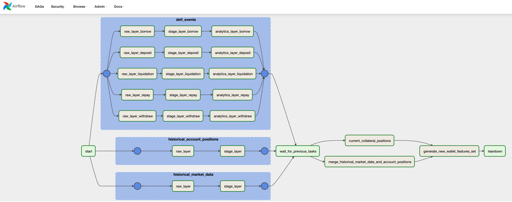

# DeFi Features Data Pipeline - Spectral Labs

This project is part of the Spectral Data Lakehouse, this project is responsible for:
1. ETL data from Subgraph API's for AAVE and Compound Protocol to the Data Lakehouse.
1. ETL DeFi events data from Transpose API.

## Features Data Dictionary

This table describes various features used to analyze a user's activity on DeFi protocols such as Compound and AAVE.

| Feature Name | Data Type | Description |
|---|---|---|
| risk_factor | float | Reciprocal of the minimum health factor across protocols. |
| total_collateral_eth | float | Total collateral in ETH across protocols. |
| total_collateral_avg_eth | float | Average collateral in ETH across protocols, measured on the first block of each day. |
| total_available_borrows_eth | float | Total amount available to borrow in ETH across protocols. |
| total_available_borrows_avg_eth | float | Average amount available to borrow in ETH across protocols, measured on the first block of each day. |
| avg_weighted_risk_factor | float | Weighted average `risk_factor` (weighted by borrow balance) measured on the first block of each day. |
| risk_factor_above_threshold_daily_count | int | The number of times a wallet's `risk_factor` exceeded a threshold of (1 / 1.2) on the first block of each day. |
| avg_risk_factor | float | Average of a wallet's `risk_factor` as measured on the first block of each day. |
| max_risk_factor | float | A wallet's maximum `risk_factor` as measured on the first block of each day. |
| borrow_amount_sum_eth | float | Sum in ETH of all individual borrow amounts. |
| borrow_amount_avg_eth | float | Average in ETH of all individual borrow amounts. |
| borrow_count | int | Number of borrow events initiated by the wallet. |
| repay_amount_sum_eth | float | Sum in ETH of all individual repayment amounts. |
| repay_amount_avg_eth | float | Average in ETH of all individual repayment amounts. |
| repay_count | int | Number of repayment events initiated by the wallet. |
| borrow_repay_diff_eth | float | `borrow_amount_sum_eth` - `repay_amount_sum_eth` |
| deposit_count | int | Number of deposit events on DeFi protocols initiated by the wallet. |
| deposit_amount_sum_eth | float | Sum in ETH of all individual deposit amounts to DeFi protocols. |
| time_since_first_deposit | int | Time in seconds since a wallet's first deposit event to a DeFi protocol. |
| withdraw_amount_sum_eth | float | Sum in ETH of all individual withdraw amounts from DeFi protocols. |
| withdraw_deposit_diff_eth | float | If_positive_eth: maximum(0, `withdraw_amount_sum_eth` - `deposit_amount_sum_eth`) |
| liquidation_count | int | Number of liquidation events on a wallet's borrow positions. |
| time_since_last_liquidated | int | Time in seconds since a wallet's last liquidation event. |
| liquidation_amount_sum_eth | float | Sum in ETH of all individual liquidated collateral amounts. |
| unique_borrow_protocol_count | int | Count of unique protocols the wallet has borrowed on |
| unique_lending_protocol_count | int | Count of unique protocols the wallet has deposited assets on |

### Data Pipeline on Airflow



### Requirements to run this project
* You need to install the AWS CLI and configure using your AWS secrets.
  * You can follow this documentation: https://docs.aws.amazon.com/cli/latest/userguide/getting-started-install.html
* You need to install the Terraform CLI in your local computer.
  * Follow this documentation to install:https://learn.hashicorp.com/tutorials/terraform/install-cli
* Docker and Docker-compose installed.

## How to run each pipeline locally?

To run the project locally you have two options, you can run using a virtual env or using Docker.

### Using Virtual Env

Create the virtual env:
```
poetry install && poetry shell
```

Run the pipeline:
```
APP_ENV=dev python <script_name> <parameters>
```

### Using Docker

To run the pipeline using docker, the first you need to do is build the docker image, to do that you can execute the follow command:
```
make build_image
```

After build the docker image, now you can execute the pipeline:
```
docker run \
  --network=host \
  -e APP_ENV=dev \
  -e SSH_TUNNEL=true \
  -e AWS_ACCESS_KEY_ID="$(aws --profile default configure get aws_access_key_id)" \
  -e AWS_SECRET_ACCESS_KEY="$(aws --profile default configure get aws_secret_access_key)" \
  <image_name>:latest \
  python <script_name> <parameters>
```

## How to deploy this project in development environment?

To deploy this project in dev environment is necessary to execute these steps:

* Create the ECS stack using Terraform on dev workspace
* Build the docker image
* Start Airflow locally

#### Create ECS Stack on dev Workspace and build the docker image

```
make create_ecs_stack_dev
```

During the process of creating the ECS Stack, the docker image will be built, so in this case, you don't need to run the docker build process, just when you apply some code change and need to update the docker image.

#### Run Airflow locally to execute the DAG

```
make setup_airflow_locally
```

Now you can access the Airflow ULR using these credentials:
* Airflow URL: http://localhost:8080
* user: **admin**
* password: **admin**

The DAG file is in the folder devops/airflow/dags and after running the Airflow, this dag will be loaded automatically, you will see the DAG in the Airflow UI.

Now the DAG it's available and you can run it.

## Checking the Data outputs

After run the data pipeline you can check the data output on the Data Lakehouse, you can see the files on bucket S3 (`data-lakehouse-{dev or prod}`) or you can execute some queries on Athena.

Tables:
```
db_raw_prod.the_graph_historical_market_data
db_raw_prod.the_graph_historical_account_positions
db_raw_prod.transpose_borrow_events
db_raw_prod.transpose_deposit_events
db_raw_prod.transpose_liquidation_events
db_raw_prod.transpose_repay_events
db_raw_prod.transpose_withdraw_events
db_stage_prod.the_graph_historical_market_data
db_stage_prod.the_graph_historical_account_positions
db_stage_prod.transpose_borrow_events
db_stage_prod.transpose_deposit_events
db_stage_prod.transpose_liquidation_events
db_stage_prod.transpose_repay_events
db_stage_prod.transpose_withdraw_events
db_analytics_prod.the_graph_current_collateral_positions
db_analytics_prod.transpose_borrow_events
db_analytics_prod.transpose_deposit_events
db_analytics_prod.transpose_liquidation_events
db_analytics_prod.transpose_repay_events
db_analytics_prod.transpose_withdraw_events
```

Example query in the development environment:
```
select * from db_raw_dev.the_graph_historical_market_data
```

Example query in the production environment:
```
select * from db_raw_prod.the_graph_historical_market_data
```